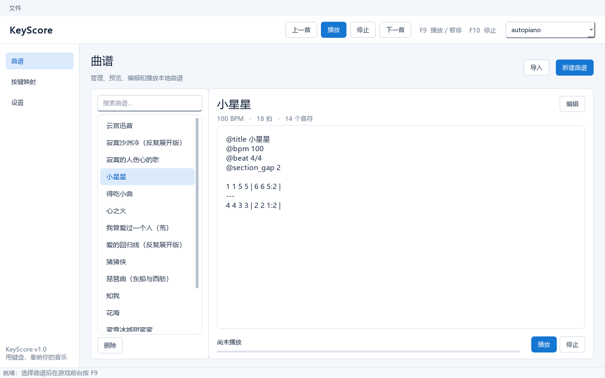

# KeyScore 键谱

面向 Windows 游戏乐器的文本简谱自动演奏工具。使用可读的文本简谱编曲，将音符转换为标准 Windows `SendInput` 键鼠事件。



> 程序只向按下 `F9` 时所在的前台窗口发送输入，不读取游戏内存，也不注入游戏进程。前台窗口变化时会自动暂停并释放所有按键。

演奏效果：[《寂寞的人唱伤心的歌》演示视频（哔哩哔哩）](https://b23.tv/Hbz9wBk)

## 当前功能

- 默认采用 Windows 11 Fluent 浅色风格，并可在“设置 → 外观”即时切换为游戏电竞风；选择后立即保存，下次启动自动恢复。
- 主窗口采用“曲谱、按键映射、设置、关于”四页结构；设置页内按“外观、快捷键”分类，顶部统一提供播放控制和当前配置方案选择。
- 搜索、导入、编辑和删除本地文本曲谱，列表可按最近修改时间或名称排序；名称排序兼容英文 A–Z 和中文拼音首字母。新建曲谱以内存草稿打开，未保存关闭时不会生成文件，保存后按 `@title` 自动同步文件名。
- 钢琴卷帘支持量化落点编辑；尾格被音符占满时自动追加三个当前精度的网格并向后滚动。
- 新建、删除并导入多份独立按键配置方案，应用重启后恢复上次使用的方案；删除当前方案后自动切换，并始终保留至少一个方案。
- 支持“音级键 + 音区修饰键”“三行音区直接映射”“五行音区直接映射”和“每个音符直接映射”四种键位模式。
- 每份配置方案可独立选择“短按触发”或“持续按住”。
- 支持整数、小数时值、休止符、和弦、连音、段落停顿和传统简谱增时线。
- 播放时可用 `F9` 暂停或继续、`F10` 紧急停止；目标窗口变化时自动暂停并释放按键。
- 支持录制游戏中的实际键鼠演奏：`F8` 开始/完成，自动按当前 Profile 反向还原音符、和弦、休止、小节和持续按住模式下的连音。
- 可在“设置 → 快捷键”自定义录制、播放、停止和编辑器拍数正向/反向切换快捷键（默认 `D` / `A`）；常用新音符拍数、顺序与默认值也可自行设置。
- 游戏按键映射支持普通单键、单独修饰键，以及 `Ctrl`、`Alt`、`Shift`、`Win` 配合键盘或鼠标主键的组合键。
- 可在“设置 → 外观”分别控制播放悬浮层、倒计时悬浮提示，并把播放/录制前倒计时设为 1～10 秒；默认均显示且倒计时为 3 秒。

## 运行要求

- Windows 10/11 64 位
- Python 3.10 或更高版本（64 位）

## 快速开始

```powershell
git clone https://github.com/ghkkdb/KeyScore.git
cd KeyScore
py -3.10-64 -m venv .venv64
.\.venv64\Scripts\python.exe -m pip install -r requirements.txt
.\run_keyscore.ps1
```

也可以安装为可编辑 Python 包后运行：

```powershell
.\.venv64\Scripts\python.exe -m pip install -e .
.\.venv64\Scripts\keyscore.exe
```

## 使用流程

1. 在左侧进入“曲谱”页面，选择已有曲谱，或点击“导入”复制 `.txt` 曲谱；选择 `.mid`/`.midi` 时会以 1/4 拍量化并提取单声部主旋律，转换结果与简化统计会保存到本地曲谱库。
2. 双击曲谱或点击“编辑”，在独立窗口中修改并保存；本地 `.txt` 文件名会同步为 `@title` 曲名，重名时自动追加数字。
3. 选中曲谱后，可点击歌单底部“删除”或“文件 → 删除当前曲谱”；确认后会从本地曲谱库移除。
4. 顶部下拉框可选择独立的游戏键位方案；通过“文件 → 新建配置方案”可从当前方案复制，通过“文件 → 导入配置方案”可导入 `.ksprofile.json`。
5. 进入“按键映射”页面后可填写方案名称、选择映射模式和音符输出方式，并录入对应键盘/鼠标按键；使用新名称保存会保留原方案，并另存一个新方案到顶部下拉栏。“设置”页面只管理主题等应用级选项。
6. 切换到游戏的乐器界面。
7. 按播放快捷键（默认 `F9`），无需选择游戏；程序自动记住当时的前台窗口并按外观设置执行倒计时。
8. 播放时再次按播放快捷键暂停或继续，按停止快捷键（默认 `F10`）紧急停止。

### 录制游戏演奏

1. 在“曲谱”页面点击“录制演奏”，设置曲名、BPM、拍号、量化精度和和弦容差。
2. 切换到游戏窗口，等待 3 秒倒计时，然后开始弹奏；收到第一个有效音符后才开始计算录制时长。
3. 按录制快捷键（默认 `F8`）完成录制，或按停止快捷键（默认 `F10`）紧急停止并保留已经录到的内容。
4. 在“录制整理”窗口检查自动生成的文本，点击“保存并打开编辑器”继续修正。

录制只收集当前 Profile 中出现的键盘扫描码和鼠标按键，不保存其他按键。游戏失去前台时录制会自动暂停，切回原游戏窗口后继续，并从时间轴排除暂停时长。播放和录制互斥，系统注入事件不会写入曲谱。短按触发模式以相邻音符的起点间隔推导时值；持续按住模式使用按下/释放时间生成音符和休止，并可把无缝相邻的单音写成圆括号连音。

如果前台窗口在播放中发生变化，播放器会自动暂停并释放所有已按下的键鼠按键。

### 配置方案

每份曲谱只保存简谱语义，不保存物理键位。个人按键配置持久化存放在应用数据目录的 `profiles/*.ksprofile.json`，当前选择保存在 `profile_state.json`，因此应用重启后会恢复上次使用的方案。导入的外部方案会先严格校验，再复制到本地 Profile 目录并立即显示在顶部下拉栏中；同名方案不会被覆盖。早期版本的单一 `profile.json` 会在首次运行新版时自动迁移。

- `degree_modifier`：音级键配合低/高音、半音按住修饰键。
- `direct_note`：按倍低/低/中/高/倍高的自然音及半音排成十行；半音行仅提供 `#1、#2、#4、#5、#6` 五个独立黑键。
- `row_octave`：设置界面只显示低、中、高三行，每行横向排列 `1～7`，不支持半音。
- `five_row_octave`：设置界面显示倍低、低、中、高、倍高五行，每行横向排列 `1～7`，不支持半音。

“音符输出方式”也随方案保存：

- **短按触发（推荐）**：每个音符按固定时长触发，适合按一下就完整发声的游戏乐器。
- **持续按住**：按键保持到曲谱时值结束前，适合长按时间会改变发声长度的游戏。

仓库中的 `data/profiles` 提供可直接使用或继续修改的示例映射方案，`data/scores` 提供示例曲谱。

## 简谱语法

```text
@title 小星星
@bpm 100
@beat 4/4
@section_gap 2

1 1 5 5 | 6 6 5 - |
---
H1
#1
L1
LL1
H5:0.5
HH1
0:2
[1 3 5]:2
```

其中 `LL1`、`L1`、`1`、`H1`、`HH1` 依次表示倍低音、低音、中音、高音和倍高音 Do；`#1` 表示按住半音修饰键后演奏 Do，`H5:0.5` 表示高音 Sol 并占用半拍。独立的 `-` 将前一个音符、和弦或休止符延长一拍，因此 `5 -` 与 `5:2` 等价，并且只触发一次音符。独立一行的 `---` 表示段落停顿，拍数由 `@section_gap` 设置；没有设置时默认停顿一拍。

同音延音线应合并为一个长音，例如跨小节持续三拍的 Do 写作 `1 - | -` 或 `1:3`；不同音符需要无缝衔接时使用圆括号，例如 `(1 2 3)`。需要连续触发两次同音时才写 `1 1`。普通换行、空行和小节线仅用于排版，不会产生停顿。完整规则及连音、延音示例见 [曲谱制作说明.md](曲谱制作说明.md)。

### 时间参数

- 音符起点间隔由 BPM 和时值决定：`60000 / BPM × 时值`。
- `0:0.5`、`0`、`0:2` 分别产生半拍、一拍和两拍的精确休止。
- 普通换行、空行和小节线不产生停顿；段落之间应使用 `---`。
- 短按触发模式下，“按键时长”决定一次 KeyDown 到 KeyUp 的最长时间。
- 持续按住模式下，按键保持时间由曲谱时值决定；`1:1.5` 会持续 1.5 拍。
- “最小释放间隔”保证在下一个拍点前提前松键，默认 10ms，用于降低连续同键被游戏合并或漏读的概率。

## 项目结构

```text
src/keyscore/       应用、曲谱解析、时间轴与输入后端
data/scores/       示例曲谱
data/profiles/     示例按键配置方案
tests/             核心自动化测试
build_test.ps1     Windows 精简测试版打包脚本
```

运行时产生的当前方案状态、应用外观设置和临时文件不会提交到仓库。

## 开发与测试

核心层只使用 Python 标准库，不安装 GUI 依赖也可运行：

```powershell
$env:PYTHONPATH = "src"
python -m unittest discover -s tests -v
```

构建 Windows 测试版需要额外安装 PyInstaller：

```powershell
.\.venv64\Scripts\python.exe -m pip install "pyinstaller>=6,<7"
.\build_test.ps1
```

## 安全说明

软件不会读写游戏内存或注入游戏进程，但自动键鼠工具仍可能违反某些游戏的服务条款。请在使用前了解目标游戏的规则。
